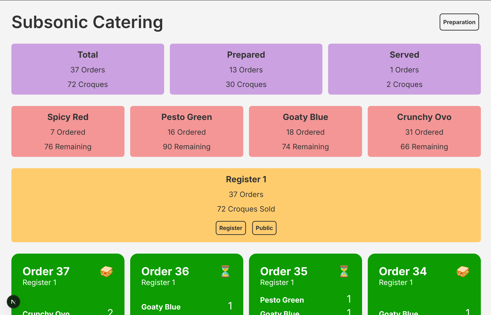
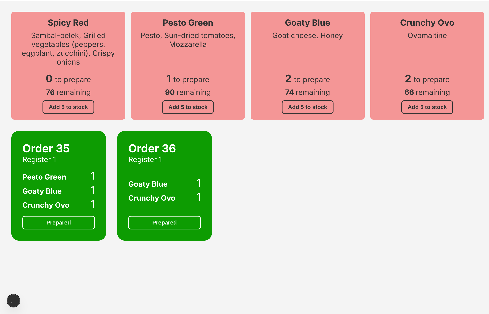
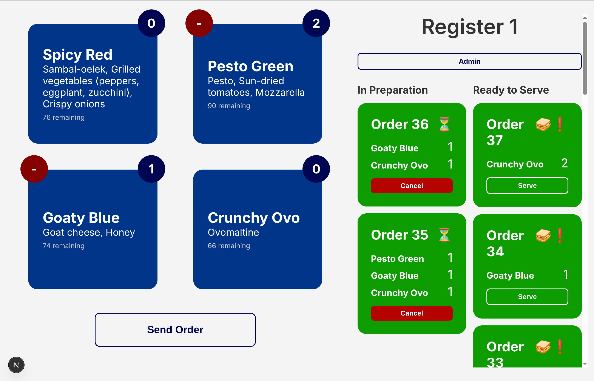

# Overclicked

Overclicked is a web application created by CLIC, used for tracking and managing orders at student-organized events.
It provides simple interfaces for event staff in various roles (at the register, in the preparation area, etc) to monitor incoming orders and update their status in real time.

It was used for the first time at the CLIC silent party, [Subsonic](https://clic.epfl.ch/news/subsonic-f24) in Autumn 2024.

## Getting Started

To run the development server:

```bash
npm run dev
# or
yarn dev
# or
pnpm dev
```

Open http://localhost:3000 to view it in the browser.

## Built With

- [Next.js](https://nextjs.org/)
- [TypeScript](https://www.typescriptlang.org/)
- [SCSS](https://sass-lang.com/)

## Features

This app includes the following views:

- Admin Dashboard: Overview of all events and their order statuses.
- Preparation View: Interface for staff to prepare orders and manage inventory.
- Register View: Interface for staff to take orders and serve customers.
- Public View: Customers can see the menu and ready orders.

### Admin Dashboard



The Admin Dashboard provides:

- Statistics on orders (total, prepared, served)
- Inventory status (stocks left)
- Register activity (orders taken per register)
- All orders listed with their statuses

### Preparation View



The Preparation View allows staff to:

- See incoming orders in real time
- Mark orders as prepared
- Add more stock for items

### Register View



The Register View allows staff to:

- Take new orders from customers
- Cancel orders if needed
- Mark orders as served

### Public View


The Public View allows customers to:

- View the menu with available items
- See orders that are ready for pickup
